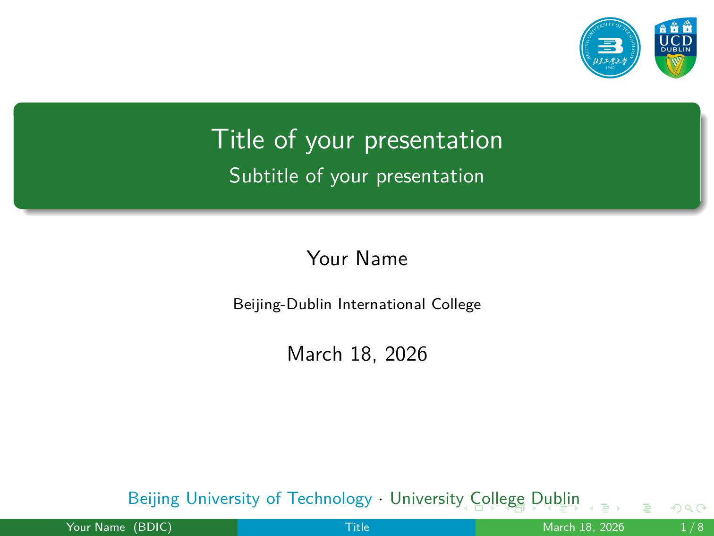
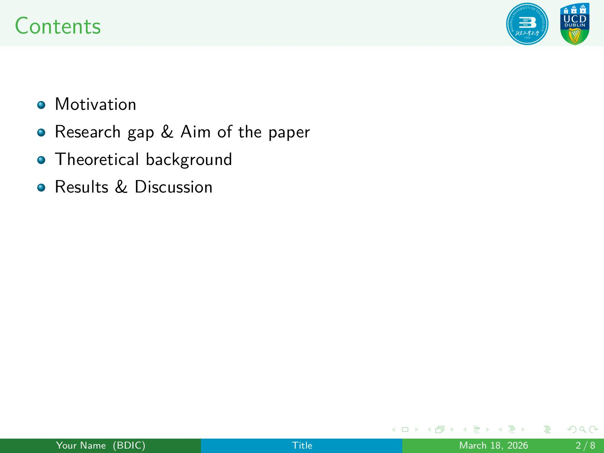
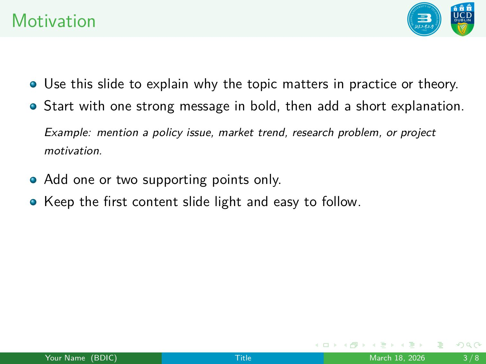
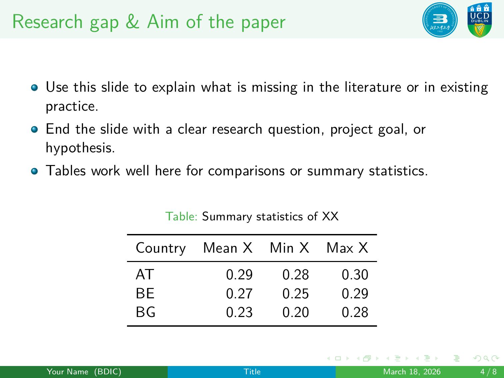
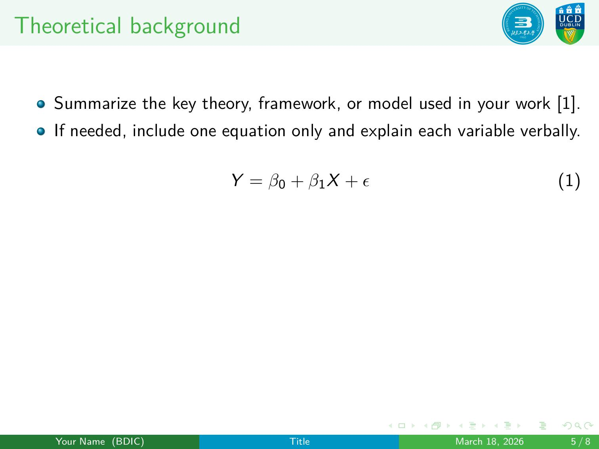
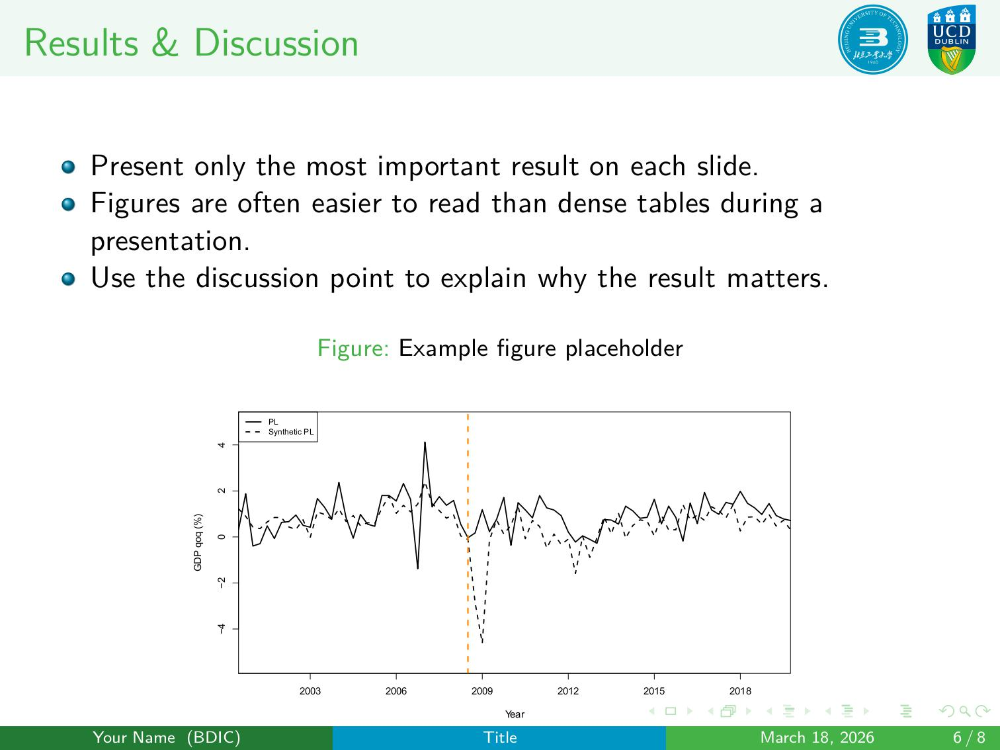
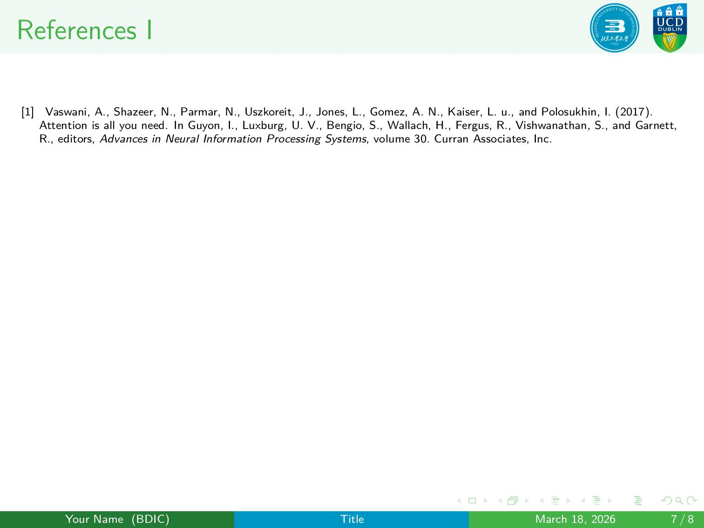
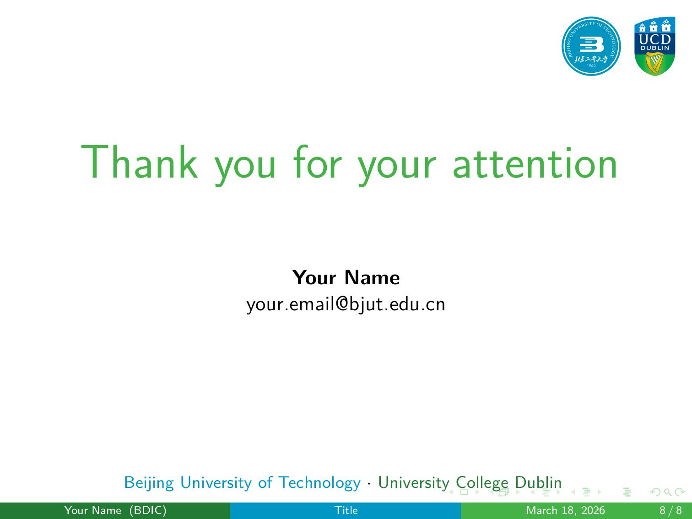

# BDIC Beamer Template

A clean Beamer template for Beijing-Dublin International College (BDIC),
Beijing University of Technology, and University College Dublin.

## Disclaimer

> [!WARNING]
> \> 🚨 This is **NOT an official template** of  
> \> Beijing University of Technology or University College Dublin.

⚠️ **IMPORTANT NOTICE**

**This is NOT an official template** for Beijing University of Technology or University College Dublin.

This template is an **unofficial adaptation** inspired by the [VSE FMV Presentation Template](https://www.overleaf.com/latex/templates/vse-fmv-presentation-template/bnwxsdjhjkvv) and is provided as-is for personal use only. If you require an official template or branding guidelines, please contact the respective institutions directly.

## Showcase

Below are 8 sample presentation slides using this template:

|                      |                      |
| -------------------- | -------------------- |
|  |  |
|  |  |
|  |  |
|  |  |

## Files

- `main.tex`: main presentation template
- `image/BJUT_Logo.pdf`: BJUT logo
- `image/UCD_Logo.pdf`: UCD logo

## Quick Start

1. Open `main.tex`
2. Update `\title`, `\subtitle`, `\author`, `\institute`, and `\date`
3. Replace the sample sections with your own content
4. Compile with `pdflatex main.tex`

## Notes

- The right-top corner shows the BJUT and UCD logos side by side.
- The theme uses BDIC green and blue accents.

